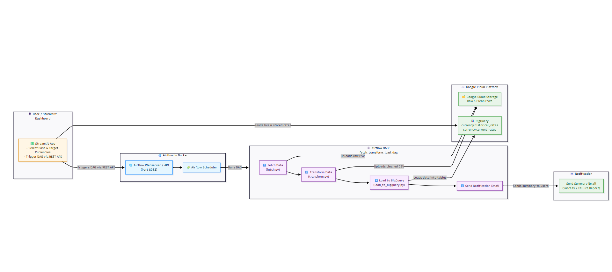

# 💹 Currency ETL Pipeline (Airflow + Streamlit + GCP)

An end-to-end **Data Engineering project** for automating currency exchange rate ingestion, transformation, and analysis — fully orchestrated with **Apache Airflow** inside Docker, and visualized via **Streamlit Dashboard**.

---

## 🏗️ Architecture Overview

### 🔸 Workflow Diagram


### 🔹 Components
- **Streamlit App** — User interface to trigger ETL and visualize data.
- **Apache Airflow (Docker)** — Orchestrates the ETL workflow.
- **Google Cloud Storage (GCS)** — Stores raw and cleaned CSVs.
- **BigQuery** — Stores historical and current exchange rate tables.
- **Email Notification** — Sends status updates after each pipeline run.

---

## ⚙️ Project Structure
```bash
currency-etl-pipeline/
├── dags/
│   ├── fetch_transform_load_dag.py
│   └── scripts/
│       ├── fetch.py
│       ├── transform.py
│       └── load_to_bigquery.py
├── app/
│   └── app.py
├── docker/
│   ├── docker-compose.yml
│ 
├── images/
│   └── etl_workflow_diagram.png
├── requirements.txt
└── README.md
